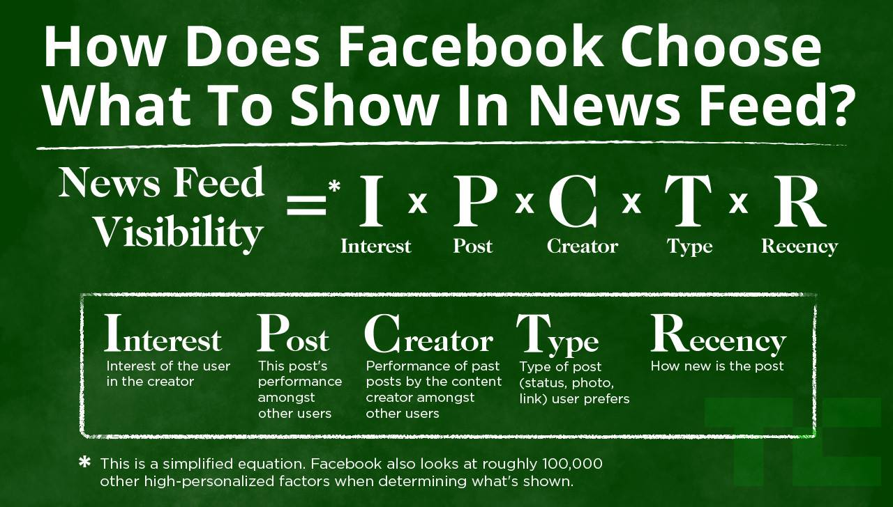
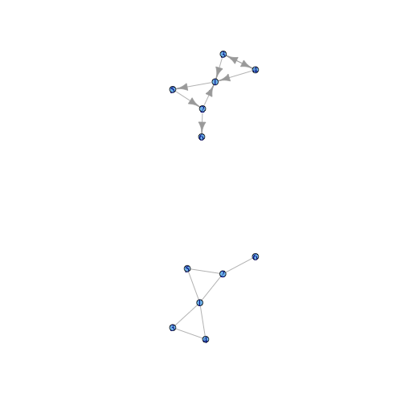
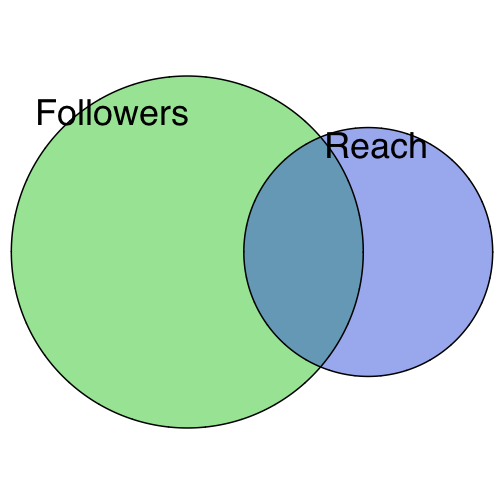
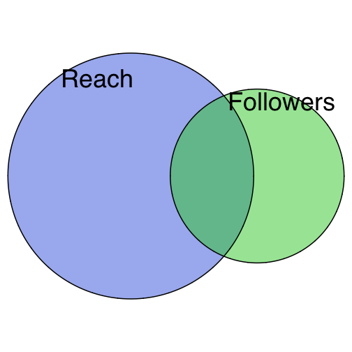
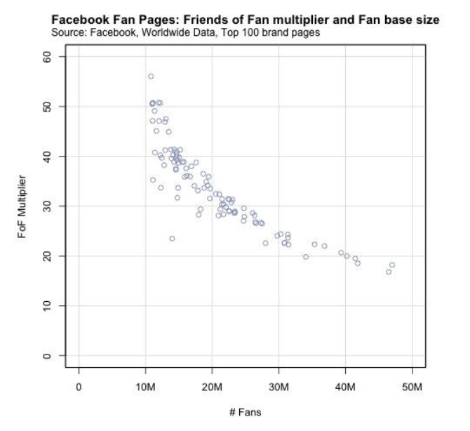
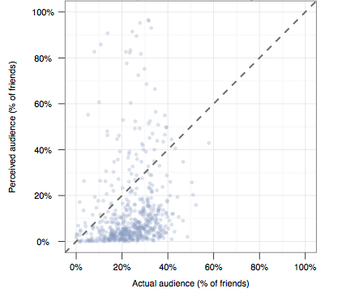
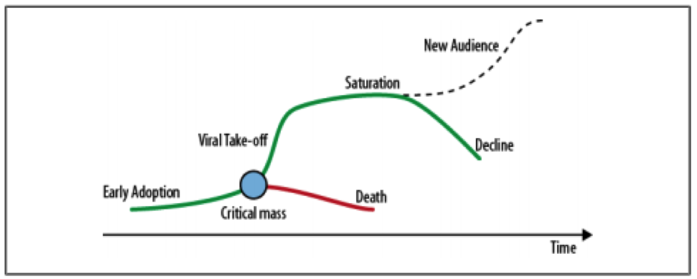
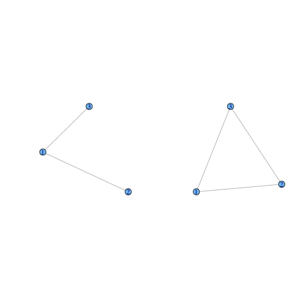
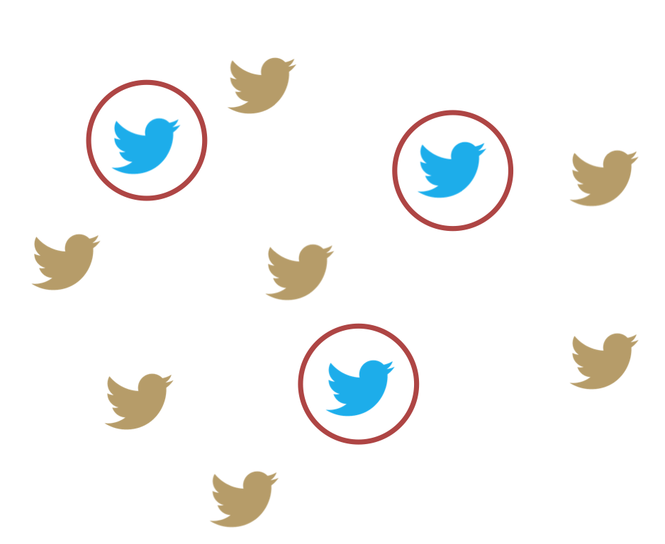

Social Media & Blogs 
========================================================
transition: rotate
# Statistics: Intro



## Lecture 1

Key Social Media Metrics
========================================================
type: sub-section

- Followers
- Reach / Impressions
- Quazi-Reach
- Engagemnt: Likes, Shares, Comments, Replies, Retweets, Favorites, etc.
- Engagement Rate
- People talking about
- Social Media CTR

Followers
========================================================

**In theory**

The most obvious metric.

## Number of users, who made at least one action (subscribed).

**In practice**

There are symmetric & asymmetric connections.

Most social networks are of mixed type.

***

 

Mixed: Facebook, VK;

Directed: Twitter, Instagram.

Followers in Facebook
========================================================

**For users**
- Friends
- Subscribers (unconfirmed requests + followers)

**For pages**
- Subscribers

**For groups**
- Members

Reach / Impressions
========================================================

## Number of users, who actually saw exact post/tweet/etc.

The main issue: aggregating.

$Cumulative\,reach \neq \sum (reach\,for\,all\,posts)$

    Mind the intersection!

But: average reach could be estimated without intersection extraction.

Reach availability
========================================================

- Facebook: for groups and for pages  (for admins).
- Twitter: for everybody (but only for account owner).
- VK: for pages.

The main issue: It's available only for owner/administrator.

    Not available for arbitrary channel.

Followers vs. Reach
========================================================
 

Followers: "number of copies"

***

 

Reach: "number of readers"

FoF-Multiplier
=======================



[The Multiplier effect of the Facebook Newsfeed](http://socialmediainfluence.com/2011/07/28/the-multiplier-effect-of-the-facebook-newsfeed/)

Reach estimates
=======================

Average: 16% of audience.
- More for photos, less for texts.
- More on 17:00--22:00, less on 02:00--06:00.

**But be careful :-)**

Good example:

Facebook, post from others on our brand wall.

Minuscule reach, far from brand audience or whatever.

Quazi-Reach
=======================

Potential audience:

$QuaziReach = \# followers_{channel} + \sum^{sharerers} \# followers$

Available in:
- IQBuzz
- Amplifr

```
Quiz: 
Reach (<, =, >) Quazi-Reach?
```

Don't get confused!

Engagement
========================

## Any type of user actions.


*** 

Obvious:

- Like of Класс! or Favorite (maybe)
- Share or Retweet or Repost
- Comment or Reply

Engagement: not so obvious
===============================

**Facebook:**
- Clicks on links in your post
- Posts from others
- Mentions
- Check-in
- Recomendation

***

**Twitter:**
- User profile clicks
- Url clicks
- Hashtag clicks
- Detail expands
- Permalink clicks
- Embedded media clicks
- Follows
- Email tweet

Engagement: PTA
==================

## The number of unique users who have created a “story” about a page in a 7-day period:

- like a page
- post on the page wall
- like a post
- comment on a post
- share a post
- answer a question

***

- RSVP to a page’s event
- mention the page in a post
- tag the page in a photo
- check in at a place
- share a check-in deal
- like a check-in deal
- write a recommendation
- claim an offer

Engagement & Reach
=======================

In 90% of the time:

- 1 comment = 10-40% of friends saw the post
- 4 comments = 18-44% of friends saw the post

It's difficult to estimate one's audience size from feedback alone.

[Quantifying the Invisible Audience in Social Networks](http://hci.stanford.edu/publications/2013/invisibleaudience/invisibleaudience.pdf)

***



Normalizing Engagement
============================

Engagement could be normalized using `Reach` or `Followers`.

Reach utilization is much more tricky. And should be used for internal KPI & estimations.

Followers utilization is called `Engagement Rate`

$EngagementRate = 100 \times \frac{likes + shares + comments}{Followers} (\%)$

Engagement Rate
============================

$EngagementRate = 100 \times \frac{likes + shares + comments}{Followers \times num\,of\,posts} (\%)$

Issues:

* Followers - artifical index
* $Unique\,engaged\,users \neq likes + shares + comments$
* $\sum{activities} > likes + shares + comments$

Nonetheless it's widely used:

* Data available for almost all channels;
* Used in SocialBakers.

Proposal
===========================
From web analytics:

$CTR = 100 \times \frac{clicks}{impressions} (\%)$

Facebook adoption:

$CTR_{SMM} = 100 \times \frac{PTA}{Reach_{weak}} (\%)$

Compound Social Media Metrics
===============================================
type: sub-section

- Activity sources
- Cores and Ballast
- k-Core
- Virality
- Interestingness
- Retention
- Dynamics Cost

(Followers vs. Reach) + Engagement
===================================
Recall Followers vs. Reach Venn Diagrams and imagine Followers - Others - Actors Venn.

It's useful to measure others / followers actions ratio:


```
                        VK.group ratio
1 За честную и легитимную власть  3.52
2                    РИА Новости  1.40
3                          Форбс  0.52
4     Мне реально нравится Путин  0.43
5          Большое правительство  0.22
6          Свободу Константинову  0.04
```

Cores & Ballast
===================
```
Fraction of followers, who produced at least k actions during defined time period
```

## k-Core definition:
* define time period (1 day, 1 week, 1 month, ..., overall)
* define k - number of actions per user (1, 5, ...)

## Overall 1-Core & 5-Core


```
                       VK.group    C1    C5
 За честную и легитимную власть 62.42 33.32
                    РИА Новости 45.80 19.60
                          Форбс 24.55  4.60
     Мне реально нравится Путин 12.66  2.77
          Большое правительство 11.29  2.37
          Свободу Константинову  2.73  0.24
```

Cores & Ballast - 2
========================
Other core-based metrics:

* average time, user stays in k-core
* average migrating time:
    * from new user to k-core - 1
    * from k-core - 1 to k-core - 5
    * ...
* users flow:
    * fraction of 1-core, that leaves core and fraction, that upgrades to 5-core


Cores & Ballast - 3
========================
```
Ballast: a kind of fake audience
```

VKontakte (5-6%):
* Do not have avatars
* Less than 3 friends
* More than 50% of friends are blocked
* User's rating is less than 50

Twitter - 0 tweets:
* MedvedevRussia ~29,6%
* ForbesRussia ~40,4%
* RIANru ~33%

Cores & Ballast - 4
========================

Ballast features:
* no activities;
* no posts;
* few friends;
* high fraction of "ballast friends";
* automated posts;
* ...

Ballast defining is highly connected to astroturfing detection problem.

***

Ballast detection services:
* [Fake Follower Check](http://fakers.statuspeople.com/)
* [TwitterAudit](http://www.twitteraudit.com/)
* [Friend or Foe // Kaspersky](http://fof.kaspersky.com)
* [Fake Followers // SocialBakers](http://www.socialbakers.com/twitter/fakefollowercheck/)


Virality - 1
=======================

## SMM Holy Grail

There exists some bifurcation point, where linear grouth turns into polinomial or power.



Virality - 2
======================

## Triadic closure

 

Georg Simmel (~1900s)

***

Triadic closure is the property among three nodes A, B, and C, such that if a strong tie exists between A-B and A-C, there is a weak or strong tie between B-C.

### Experiments with random generated graphs show, that on density level about 7% triadic closure goes from linear to exponential.

But it's theory, not measurement concept.

Virality - 3
==================

## Can we measure viral potential / interestingness?

1. Prepocessing:

   Construct an engagement estimation measure (number of reactions, engagement rate, etc.).
   
2. Preprocessing:

   Using machine learning or classic regression technics build model for estimating engagement measure. Use time/followers/reach/content type and length as factors. 
   
   Model should predict engagement estimation for post in several time points: 5 mins after publishing; 10 min; 1 hour; 24 hours...

Virality - 4
==================

3. Estimating:

   Compute engagement measure for published content during defined on previous steps intervals.
   
   Using created model compute estimation for published content on the same time intervals.
   
4. Estimating:
   
   Compare estimated and real engagement measure:
   
Virality - 5
================



***

$Interestingness = \frac{engagement_{real}}{engagement_{estimated}}$
   
$Interestingness \gg 1 \Rightarrow Content\,is\,viral$
   
$Interestingness \ll 1 \Rightarrow Content\,is\,boring$

Source: [Inferring the interesting Tweets in your network](http://www.willwebberley.net/static/downloads/retreat2013.pdf)

Retention - 1
================

Select base for retention metrics:
* Followers
* k-Core
* Actors

Choose time interval for retention metrics:
* day
* month
* start of SMM-camaign

Choose wright type of retention!

Retention - 2
=======================

$Day\,N\,retention = \frac{Fraction\,of\,users\,entered\,base\,on\,0\,day\,and\,stayed\,till\,N\,day}{Users\,entered\,base\,on\,0\,day}$

But it's possible to use more tough conditions, based on activities:
* full retention (everyday activity)
* classic retention (N-day activity)
* rolling retention (N-day, or after that date)
* return retention (any day before N)
* bracket-dependent retention (using lower interval: 1-3-7-28-60 days)

Dynamics cost - 1
========================

### Example 1:

**New subscr $\gg$ Gone subscr**

Number of new subscribers = 120

Number of gone subscribers = 20

Daily users grouth = 100

***

### Example 2:

**New subscr $\approx$ Gone subscr**

Number of new subscribers = 1000

Number of gone subscribers = 900

Daily users grouth = 100

Dynamins cost - 2
================================

$DC_{index} = \frac{new_{subscribers} - gone_{subscribers}}{new_{subscribers} + gone_{subscribers}}$


```
  Examples DC.index
 Example 1  0.71429
 Example 2  0.05263
```

$-1 \leq DC_{index} \leq 1$

$DC_{index} \approx -1 \Rightarrow evacuation$

$DC_{index} \approx 0 \Rightarrow dynamics\,cost\,is\,too\,high$

$DC_{index} \approx 1 \Rightarrow excellent$

The End
========================================================
type: sub-section

## Questions & answers
