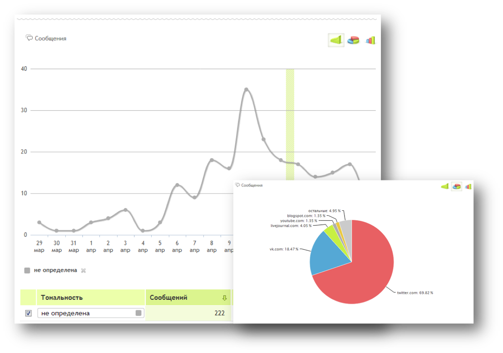

Social Media Monitoring 
========================================================
transition: rotate

## Lecture 3

SM Monitoring: what's for?
========================================
type: sub-section

* SM as news source
    * Civil journalism
    * UGC
* Marketing
    * Brand monitoring
    * Customers reviews
    * Loyal audience
    * Customers support

Social Media - Brand Monitoring
========================================

More than a half takes into account internet reviews

Social Media - Brand Monitoring
========================================

More than a half takes into account internet reviews

Social Media - Brand Monitoring
========================================

But just a few authors produce reviews

Social Media - Brand Monitoring
========================================
## Fails:

* [United Breaks Guitars](http://www.youtube.com/watch?v=5YGc4zOqozo): --$180,000,000 (10%)

## and Wins:

* Morton's Steakhouse and Piter Shankman: ~1M mentions in Twitter

    [First tweet](https://twitter.com/petershankman/status/103936299983060993)

Social Media - News Monitoring
=======================================

* Disaster Response 

    Red Cross Digital Ops: CRM system based on Radian6
    
    2011, USA:
    
    49% of respondents would use social media channels to let friends and family know that they are safe
    
    44% would use Twitter or Facebook to try to request help
    
* Media: UGC

    You - Reporter, Ridus, etc.

SM Monitoring at hand
========================================
type: sub-section

* SM internal search tools
* Yandex blogs
* DIY

Social Media search tools
======================================

* Twitter: one of the best. Has it's own [query language](https://dev.twitter.com/rest/public/search)

    smiles in queries, datetime markers, from & to attributes

* VK.com: last days are indexed good

* Facebook :-(

## But! 

### All these networks are indexed by Yandex.Blogs

When search engine is enough
=======================================

* Daily mentions rate < 100...999
* Estimate is OK
* Budget issues

Search engine issue
=======================================

* It's main goal - to find relevant document(s)

* Ideal search engine should return **1** document /best matching/

* Monitoring systems should return everything

* Solution: specify query, extended search only!

* Putin: 375k without specs, 501k during 1 month

Yandex query language
=======================================

AND, OR, NOT - basic logic constructions

Yandex specific issues:

* & -- looks only inside 1 sentense
* ! - letter to start
* !! - normal form
* ~ - NOT
* | - OR
* [Other](http://help.yandex.ru/search/query-language/crib-sheet.xml)

DIY-approach
======================================

We used for competitors analysis.

Thorough API

Issues:

* Specific sources
* Special content types

SM Monitoring tools
=======================================
type: sub-section

* IQBuzz
* Brand Analytics
* YouScan
* Wobot
* Babkee
* Radian6
* Lithium
* Sysomos

Monitoring sevices - RUS
=======================================

Almost the same

I have one slide for each system, but it's too boring

Babkee, Wobot, BuzzLook, YouScan, Brand Analytics, IQBuzz

Two main features to compare:

* Sources (database volume)
* Interface

Add-on:

* "killer-features"

Babkee
===================================

Should never be used :)

* Poorest database
* No query language
* Limited query string

Wobot (or YouScan, or SemanticForce)
===============================

Good enough for simple tasks

* Reasonable database
* No complicated queries
* Mandatory manager participation

BuzzLook
==============================

Middling system

* So-so database
* Query language by Yandex

IQBuzz
==============================

Top-2 system (I think so)

* Relevant database
* Complicated query language

IQBuzz-2
==============================

* Interface features
    - Sub-folders
    - Topic extraction (Инфоповоды)

* New version (http://new.iqbuzz.ru)
    - widgets (exportable)
    - desktops

Brand Analytics
==============================

Top-2 system

* Best database ever
* Simple interface
* Flexible management :)

Database comparative studies (2011)
========================================================

[Link](http://www.slideshare.net/Sky_Promo/2-10673972)

Database comparative studies (2013)
========================================================

Database comparative studies (2014...)
========================================================

## Now:

* We have Brand Analytics
* Yandex indexes russian-speaking Facebook

Complicated queries
=======================================================

Required to get exact what you are looking for.

Complicated tuning is not a defect!

/As lazy managers could think/

Complicated queries
=======================================================

***

## Logic

* AND, &, && - every item
* OR, | - at least one item
* NOT, !, ~, - - not this item
* (), {} - grouping

## Help
* [Yandex](http://help.yandex.ru/search/?id=1111313)
* [IQBuzz](https://iqbuzz.zendesk.com/entries/40230216-Язык-запросов-IQBuzz)

Mortal sins
=====================================================

1. Concatinating keywords without ANY operators (at least, when it's prohibited)

2. Mixing AND with OR in one block without hierarchy

3. Synonyms assumption: robots shouldn't merge synonnyms. People should. 

Just bragging :)
=====================================================

{(обострение | ухудшение | обострилась | ухудшилась) & (экологическая & обстановка), 5} | {(незаконная | незаконно | планируют) & (вырубка | вырубают | уничтожение | уничтожают), 3} | {(увеличились & огромные & катастрофические & вредные) & выбросы, 4} | {(нет | устарело | некачественное | "не работает" | плохой) & {очистное & (оборудование | сооружения | фильтр | электрофильтр), 3}, 5} | {(состояние | загрязнение) & (почвы |земли| среды | экологии | воды | воздуха| акватории), 4} | {несанкционированная & (свалка | стоянка), 3} | {(складирование | завал | свалка | полигон | захоронение | куча) & (мусор | отходы | вещества | ТБО | химический), 5} | {(уничтожение | вымирание | исчезают | ущерб | отравляют) & (флора | фауна | ландшафт | природа | леса), 5} | {{экологическая & (экспертиза | обстановка | проблема), 3} & (отсутствует | нарушена | нет | без | заключение), 5} | {(запах | выбросы | воняет) & (стирол | формальдегид | метилмеркаптан | сероводород | аммиак | фекалии | "выхлопные газы" | снижение), 4} | "построено *{2} незаконно" |  {(вытекло | разлив) & (горючее | нефтепродуктов), 3} | "рост антропогенной нагрузки" | {"нарушение законодательства" & (водного | экологического), 3}

Foreign systems
=======================================================

* [Sysomos](http://www.sysomos.com)
* [Radian6](https://login.radian6.com)
* [Crimson Hexagon](http://www.crimsonhexagon.com)

Issues:

* Language
* CRM-centered
* Top-3 RU Social Media: VK, OK, MM

The End
========================================================
type: sub-section

## Bonus Track

[Lithium](http://www.lithium.com/products-solutions/social-media-management)

* Every incoming social post is automatically routed.
* Posts are scanned and assigned priorities.

***

