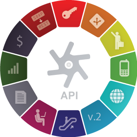
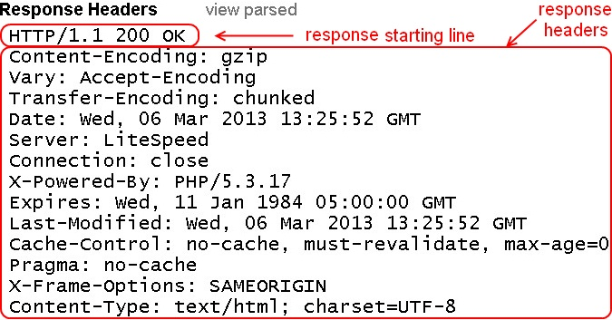
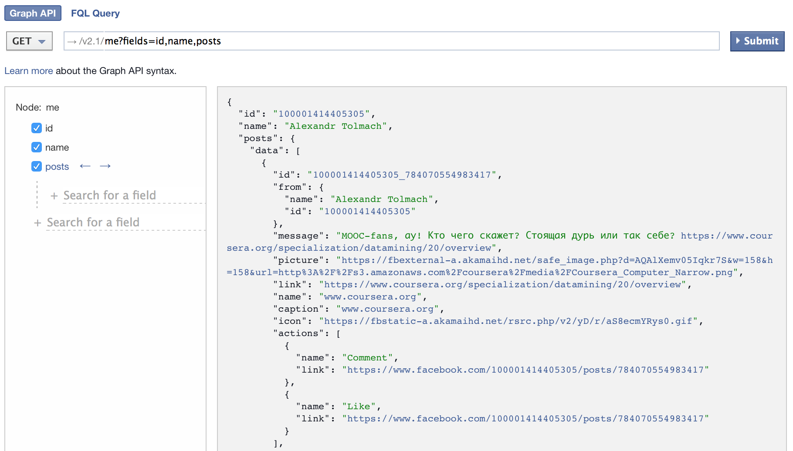
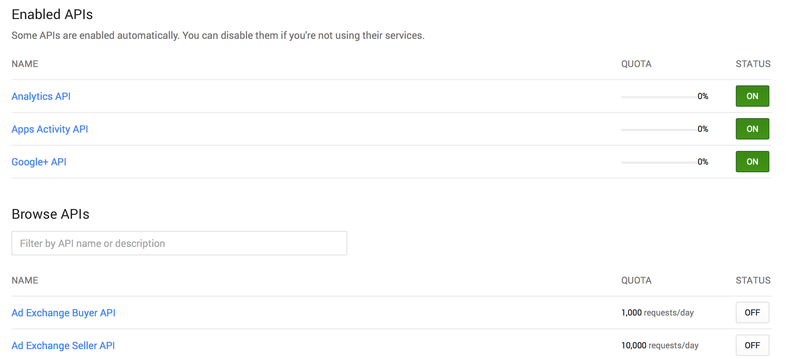
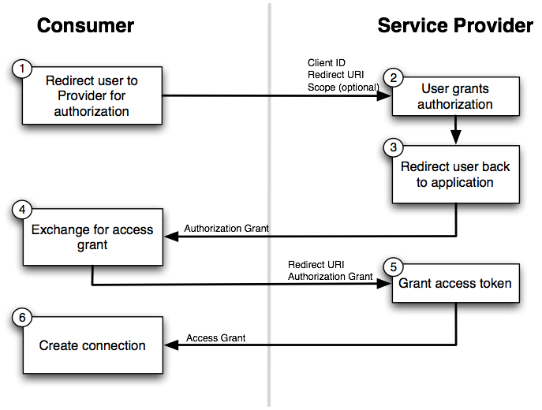

API & Data Structures
========================================================
transition: rotate


## Lecture 4-5

Application programming interface
========================================================
type: sub-section

* API
* SDK
* App-to-app communiction

API
=======================================================

API specifies a set of functions or routines that accomplish a specific task or are allowed to interact with a specific software component. 



SDK
=======================================================

## Software Development Kit

Set of software development tools that allows the creation of applications for a certain software package.


API as C2C language
=======================================================

We need to specify grammar, lexicon, and dialog rules.

1. Format to build question.
2. Answer format.

## HTTP Example



Data structures
========================================================
type: sub-section

* Collections
* Named & unnamed collections
* Unnamed collections: vector, list, set
* Named collections: dictionary, associative array

Why collections?
========================================================

## Collections of what?

### Different types of single variables:

* Integer
* Float
* String
* Text
* Date/Datetime/etc...

Collection of unnamed objects
========================================================

* Elements are addressed by index.
* Order of elements in array is important.
* Nested collections could be transformed to multidimensional.


Types of unnamed collections
========================================================

## Vector / Tuple

* Easy indexing
* Issue with adding elements
* Hashable data type

## List

* Adding/deleting arbitrary elements
* Non-hashable data type

## Set

* Every set element should be unique
* Easy intersection/union operations

Unordered Associative array
========================================================

## Dictionary / Named collection

Set of key-value pairs

* Every key is unique
* Keys - only hashable datatypes

Data types summary
========================================================

Two basic types:

* `[item1, item2, item3, ...]`
* `{key1:value1, key2:value2, key3:value3, ...}`

There are some limits on keys.

.json data format
========================================================
type: sub-section

JavaScript Object Notation, is an open standard format that uses human-readable text to transmit data objects. It is used primarily to transmit data between a server and web application, as an alternative to XML.


XML
========================================================

## Extensible Markup Language 

Both human-readable and machine-readable

Elements:
* Tags
* Elements
* Attributes

XML and its extensions have regularly been criticized for verbosity and complexity.

Basic .json data types
========================================================

* Number — a signed decimal number that may contain a fractional part and may use exponential E notation.
* String — a sequence of zero or more Unicode characters. Strings are delimited with double-quotation marks and support a backslash escaping syntax.
* Boolean — either of the values `true` or `false`.

* Array — an ordered list of zero or more values, each of which may be of any type.
* Object — an unordered associative array (name/value pairs). All keys must be strings and should be distinct from each other within that object.

* null — An empty value, using the word `null`

.json example
=======================================================

```
{
  "firstName": "John",
  "lastName": "Smith",
  "age": 25,
  "address": {
    "streetAddress": "21 2nd Street",
    "city": "New York",
    "state": "NY"
  },
  "phoneNumbers": [
    "212 555-1234",
    "646 555-4567"
  ],
  "children": [],
  "spouse": null
}
```

Web API elements
=======================================================

* Endpoints (URL addresses)
* Parameters (request-specific parameters)

`--------------------`

* Request (endpoint + parameters)
* Response (json, or xml, or YAML, etc. object)

Yet Another Example
========================================================

## GeoNames

Free geocoding service with working API (both direct & reversed)

[http://api.geonames.org/findNearbyWikipediaJSON?lat=55.75&lng=37.62&maxRows=100&username=sobach82](http://api.geonames.org/findNearbyWikipediaJSON?lat=55.75&lng=37.62&maxRows=100&username=sobach82)

```
http://api.geonames.org/findNearbyWikipediaJSON
{lat      : 55.75,
 lng      : 37.62,
 maxRows  : 30,
 username : sobach82}
```

Yet Another Example - continued
===========================================

[GeoNames Documentation](http://www.geonames.org/export/web-services.html)

[Validator and viewer](http://jsonformatter.curiousconcept.com)

## POSTman Chrome extension

It's time to install it!

Other APIs
==========================================

## Facebook sandbox

[https://developers.facebook.com/tools/explorer/](https://developers.facebook.com/tools/explorer/)



Other APIs
==========================================

## ReKognition sandbox

[https://rekognition.com/demo/face](https://rekognition.com/demo/face)


Other APIs
=========================================

[https://console.developers.google.com](https://console.developers.google.com)



Other APIs
========================================

## Exchange rates

[http://www.getexchangerates.com/api/latest.json](http://www.getexchangerates.com/api/latest.json)


Other APIs
========================================

## Wikipedia

[http://ru.wikipedia.org/w/api.php?action=query&list=search&srwhat=text&format=json&srsearch=RIA+Novosti](http://ru.wikipedia.org/w/api.php?action=query&list=search&srwhat=text&format=json&srsearch=RIA+Novosti)


Other APIs
========================================

## [DBPedia Spotlight](https://github.com/dbpedia-spotlight/dbpedia-spotlight/wiki/Web-service)

[http://spotlight.dbpedia.org/rest/annotate](http://spotlight.dbpedia.org/rest/annotate)


Request type: POST, URL-encoded

Params: text, confidence (0.2), support (20)

Headers: Accept:application/json

Other APIs
=========================================

## Mashape Catalogue

[https://www.mashape.com/explore](https://www.mashape.com/explore)

APIs of any kind. A lot of categories:

* Location
* Social
* Data
* Finance

Free and paid

Authorization issue
===========================================

We didn't explore all the examples. Why?

Because of authorisation.

Two types of limitations:
* time-based
* user-based

OAuth2
===========================================

Most popular protocol today



Helps to keep data private

OAuth2 - Instagram
===============================================

1. Go to [developers page](http://instagram.com/developer/) page. Login, if needed.
2. Create new app ("Register Your Application" button). Then create a new app.
3. Fill all the fields (Application Name, Description, Website, and OAuth redirect_uri). Type whatever you want, just remember about urls format.
4. After application creation go to "managers page" and copy Client ID and Redirect URI.
5. Substitute them into this URL: `https://instagram.com/oauth/authorize/?client_id=[Client_ID]&redirect_uri=[Redirect_URI]&response_type=token` and open it in your browser.
6. You will be asked to authorize your app and after this you will be redirected to the page, specified earlier. In browser address bar - in the end of your redirect address "access_token" parameter would be written. As for now, this token doesn't expire, so you need to do this task only once.

Instagram API - POSTman
===================================================

* `https://api.instagram.com/v1/users/search?q=[query]&access_token=[token]`
* `https://api.instagram.com/v1/users/[user_id]/?access_token=[token]`
* `https://api.instagram.com/v1/users/[user_id]/media/recent/?access_token=[token]`
* `https://api.instagram.com/v1/media/[media_id]?access_token=[token]`

The End
========================================================
type: sub-section

## Questions & answers

## Next lecture:

* Getting tokens for other networks
* SM API possibilities and limitations
