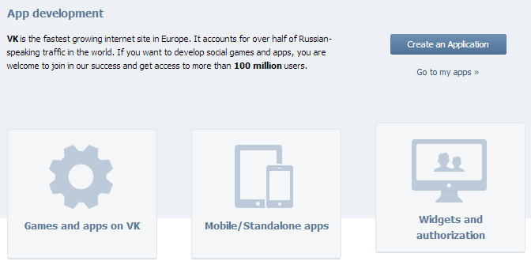
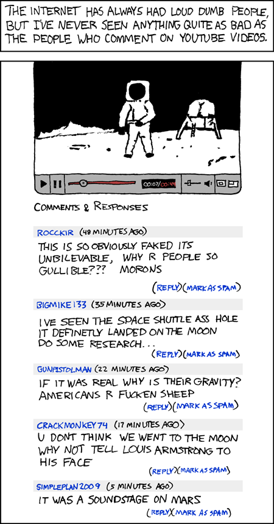

Social media API
========================================================
transition: rotate

## Lecture 5

Popular social media API description
========================================================
type: sub-section

* Instagram (recall)
* Twitter
* Facebook
* VK.com
* YouTube
* Google+
* Odnoklassniki
* Livejournal
* Foursquare

Instagram API - Authorization
=======================================================

* Link to developers page: [http://instagram.com/developer/](http://instagram.com/developer/).
* Android or iOS device required. New accaunt could be created only through the app.
* Device required only once.
* For most requests `client_id` is enough.
* OAuth2 protocol is used.
* For user-specific requests `access_token` is required.
page. Login, if needed.
* For real-time API usage callback URL is required.

Instagram API - Time rates
========================================================

* 5000 requests per hour per `access_token` or `client_id` overall.
* In case of single user (analytic) there is no difference.
* Comparative parameters per 1 minute:
    - profiles: 100
    - statuses: 500
    - comments: 2000

Instagram API - Available data
========================================================

## RESTful API

* Profiles
* Relationship
* Posts (media) + Comments + Likes
* BUT: 150 last comments only
* Tags and Locations

***

## Real-time

* Complicated realization (compared to Twitter)
* Available filters:
    - Users
    - Tags
    - Places (4sq database)
    - Geographies (circles)

Twitter API - Authorization
=======================================================

* Link to developer page: [https://apps.twitter.com](https://apps.twitter.com).
* New user account registration is quite easy.
* OAuth2 protocol is used.
* Every request should be signed.
* There is option to generate `access_token` and `access_token_secret` for developer.

Twitter API - Time rates
========================================================

* Different time-rates for user-based authentication and app-based.
* Different time-rates for different endpoints.
* 15 to 450 requests per 15 min window. [Full table](https://dev.twitter.com/rest/public/rate-limits).
* Comparative parameters per 1 minute:
    - profiles: 1000
    - statuses: 1000
    - comments: 1000

Twitter API - Available data
========================================================

## REST API

* Profile
* Followers/Following (extreemly slow, 1 request per minute)
* Tweets
* Wide search capabilities (tag, author filtering)
* No demographic data

***

## Stream API

* Sprinkler / Firehose / Filter
* Available filters:
    - Users
    - Keywords
    - Location

Twitter API - Stream data
=======================================================

* Filter stream couldn't be more than Sprinkler (sample)
* 1% of all tweets: Twitter samples the tweets by delivering only tweets created within a 10-millisecond window out of the 1,000 milliseconds in every second.
* 30-80 tweets per second.
* Streaming API almost returns the complete set of the geotagged tweets. Although the number of geotagged tweets is still very small in general (∼1%).

Facebook API - Authorization
=======================================================

***

* Link to developer page: [https://developers.facebook.com/docs/reference/api/](https://developers.facebook.com/docs/reference/api/).
* Application specific authorisation is available: `app_id|app_secret`.
* With app-level token there is no access to number of subscribers, there could be problems with posts links.
* User-specific tokens could be expired.

Facebook API - Time rates
========================================================

* There is no official info.
* Experiments: 1 request per second.
* Comparative parameters per 1 minute:
    - profiles: 50
    - statuses: 750
    - comments: 2500
    
Facebook API - Available data
========================================================

* Most of really interesting data is covered because of privacy:
    - friends
    - followers
    - age/occupation/interests
* Posts/comments/likes info mostly available.
* Public Feed API & Keyword Insights API - interesting, but not public.

Facebook API - FQL
========================================================

## `SELECT friend_count FROM user WHERE uid = xxx`

* It's a part of REST API
* SQL-like syntax
* Designed to mirror regular API
* There are some differences
* Exmaples: friend_count, following, posts in groups

VK.com API - Authorization
=======================================================

* Link to developer page: [http://vk.com/dev](http://vk.com/dev).
* Some requests are available without authorization (bad practice).

VK.com API - Time rates
========================================================

* ~ 3 requests per 1 second
* Try to refute :)
* [execute](https://vk.com/dev/execute) API method could even do better (uses simplified JavaScript)
* Comparative parameters per 1 minute:
    - profiles: 50
    - statuses: 3000
    - comments: 5000
    
VK.com API - Available data
========================================================

* Whatever you want: sex, age, interests, friend lists, is_online
* Posts/comments/likes/shares
* Today almost the only place for friendship networks analysis
* One more thing: no difference for groups/pages/events
* Bad thing: geo-data is not popular. Mostly exported from Instagram/Foursquare (Swarm)

YouTube & Google+ API - Authorization
=======================================================

* Unified developers console for all Google APIs: [https://code.google.com/apis/console/](https://code.google.com/apis/console/)
* Server key is available, mostly it's quite enough. Though it does not grant access to user-specific data (like GAnalytics)

YouTube & Google+ API - Time rates
========================================================

***

## Google+

* 5 requests per second for server-key authorization
* 250 (!!!) requests per second for authorized users

## YouTube

* 30 000 units per second (???)
* List of videos request ~ approx. 10 units

YouTube & Google+ API - Time rates
========================================================

## Google+

* Comparative parameters per 1 minute:
    - profiles: 100
    - statuses: 1000
    - comments: 2000

***

## YouTube

* Comparative parameters per 1 minute:
    - profiles: 50
    - statuses: 400
    - comments: 700

YouTube API - Available data
========================================================

* Response data organized to `feeds`
* There are video-feeds (search or channel)
* Subscribers/playlists feeds
* Users/comments feeds
* .json is quite strange
* max. ~1500 comments (like Instagram)

Google+ API - Available data
========================================================

* Personal info is hidden
* People methods exist
* Activities methods (posts/comments/+1)

Odnoklassniki API - Authorization
=======================================================

* Last year creating new app was quite tricky:
    - Getting developers access
    - Creating new app
    - E-mail notification
    - E-mail request for app permissions
* Now OK has new API, and less info about app registering.

Livejournal API
=======================================================

* There is no **REAL** API
* Bots and spyders are allowed (with appropriae User-Agent)
* No need to register, authorize app

## Time rates

5 requests per second

Livejournal API - Available data
========================================================

* Most of the data is in `html`, `rss`, `xml` format (like FOAF)
* Only 5000 friends are avaqilable
* .html could be parsed through light format (`format=light`)
* Comments, organized into trees, require recursive parser

Foursquare API - Authorization
=======================================================

* Link to developer page: [https://ru.foursquare.com/developers/apps](https://ru.foursquare.com/developers/apps).
* Oauth2 is used

## Foursquare API - Time rates

* 5000 request per hour

Foursquare API - Available data
========================================================

* A lack of data :(
* 2011: there was working `herenow` endpoint
* Now: it works only for FoF
* Data could be retrieved only if it was shared
* Twitter/VK -- bit.ly -- Foursquare mashup

The End
========================================================
type: sub-section

## Questions & answers
