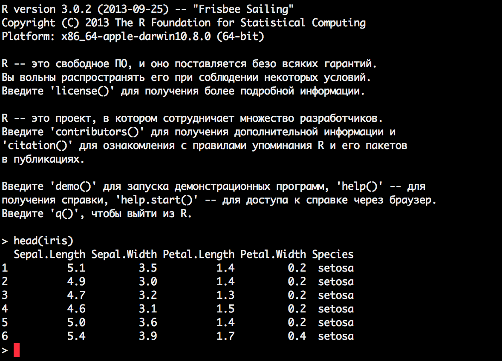

Working with R
========================================================
transition: rotate


## Lecture 6

What is R?
=======================================================

## R is a free software environment for statistical computing and graphics.

History
========================================================

* 1976: In Bell Labs `S` language was created
* 1988: Commercial version `S-PLUS` appeared
* 1993: Fork `R` appeared
* ~2000: `R` getting more and more popular

Pure R
=======================================================



RStudio IDE
========================================================


CRAN & packages
========================================================

## Free software "tradition":

* CTAN: Comprehensive TeX archive network
* CRAN: Comprehensive R archive network
* ...

### Another sources:

* Bioconductor
* GitHub

Main IDE frames
===================================================

### Editor

Create and edit scripts

In regular R: separate editors could be used.

`Ctrl + Enter` to execute selected part

## Console

Main window:

`> a <- 5 * 5`

***

### Environment

All variables and types

\+ Viewer

### Help & plots

In regular R:

- help inside console
- plots in separate windows

Primitives
=====================================

```r
# help on function
?lm

# math functions
2 + 3
10 / 3
sqrt(9)

# assigning
a <- 'Hello, world!'
```

## Adding packages

```r
install.packages("ggplot2")
library(ggplot2)
require(ggplot2)
```

Working directory
=====================================


```r
getwd()
```

```
[1] "/Users/quatsch/Documents/RIA_lectures"
```

```r
# Set required WD
setwd('C:/Documents/my_R_project')

# Show files in current WD
dir()

# View raw file
file.show()
```

Loading tables
====================================

```r
read.table(fname)

read.csv(fname)

read.csv2(fname)

read.delim(fname)

read.delim2(fname)

require(xlsx)
read.xlsx(fname, sheetName)
```

Writing files
====================================

```r
write.table

write.csv

write.csv2
```

Demo data
====================================


```r
head(cars, 5)
```

```
  speed dist
1     4    2
2     4   10
3     7    4
4     7   22
5     8   16
```

```r
iris
mtcars
Titanic
# etc...
```

First graphic
====================================


```r
plot(cars)
```

 

***


```r
hist(cars$speed)
```

 

Basic data types
=======================================

* Numeric `10.5` / Integer `10` / Complex `1 + 2i`
* Factor


```r
factor(c('m', 'v', 'm', 'v', 'v'), levels = c('m', 'v'))
```

```
[1] m v m v v
Levels: m v
```

* logical `True (T) / False (F)`
* character

Missing & special data
==========================================


```r
# NA
vec <- c(3, 10, 8, NA, 5, 6)
mean(vec)
```

```
[1] NA
```

```r
mean(vec, na.rm=T)
```

```
[1] 6.4
```

Missing & special data
==========================================


```r
# Additional: NaN, Inf, and -Inf
pi/0
```

```
[1] Inf
```

```r
0/0
```

```
[1] NaN
```

```r
as.logical(0/0)
```

```
[1] NA
```

Converting
=====================================

```r
vec <- factor(c('1982', '1983', '1982', '1984', '1985'))
```


```r
# Wrong
as.numeric(vec)
```

```
[1] 1 2 1 3 4
```

```r
# Right
as.numeric(as.character(vec))
```

```
[1] 1982 1983 1982 1984 1985
```

Sequences - Vector
======================================


```r
# concatenate
vec <- c(TRUE, 1, 0.5, 'item')

# vector elements should be of the same class
class(vec)
```

```
[1] "character"
```

```r
# slicing
vec[3:4]
```

```
[1] "0.5"  "item"
```

Sequences - Matrix
=========================================


```r
v <- 1:9
v
```

```
[1] 1 2 3 4 5 6 7 8 9
```

```r
dim(v) <- c(3,3)
v
```

```
     [,1] [,2] [,3]
[1,]    1    4    7
[2,]    2    5    8
[3,]    3    6    9
```

Sequences - List
=======================================


```r
test.list <- list(i1 = TRUE, i2 = 1, i3 = 0.5, i4 = 'item')

# every element is independent
class(test.list)
```

```
[1] "list"
```

```r
# slicing
test.list[4]
```

```
$i4
[1] "item"
```

```r
test.list$i4
```

```
[1] "item"
```

Sequences - Data Frame
========================================

Imagine list of multiple vectors (columns):


```r
df <- data.frame(var1 = c('f', 'm', 'm', 'f'),
                 var2 = c(1982, 1982, 1983, 1985),
                 var3 = c(TRUE, FALSE, FALSE, FALSE))

df
```

```
  var1 var2  var3
1    f 1982  TRUE
2    m 1982 FALSE
3    m 1983 FALSE
4    f 1985 FALSE
```

Data Frames Slicing
==========================================


```r
nrow(iris)
```

```
[1] 150
```

```r
iris.filtered <- iris[iris$Species == 'setosa', ]
nrow(iris.filtered)
```

```
[1] 50
```

```r
head(iris[, 'Species'])
```

```
[1] setosa setosa setosa setosa setosa setosa
Levels: setosa versicolor virginica
```

Vectorized computations
==========================================


```r
df <- data.frame(var1 = c(1, 2, 3, 4, 5, 6),
                 var2 = c(10, 20, 30, 40, 50, 60))
df$var3 <- df$var1 + df$var2
df$var4 <- df$var1 * df$var2
df
```

```
  var1 var2 var3 var4
1    1   10   11   10
2    2   20   22   40
3    3   30   33   90
4    4   40   44  160
5    5   50   55  250
6    6   60   66  360
```

apply VS for
===========================================


```r
#head(trees, 3)
apply(trees, 2, mean)
```

```
 Girth Height Volume 
 13.25  76.00  30.17 
```

```r
for(row in names(trees)){
  print(paste(row, mean(trees[, row])))
}
```

```
[1] "Girth 13.2483870967742"
[1] "Height 76"
[1] "Volume 30.1709677419355"
```

Basic functions for stat analysis
============================================

```r
mean()
median()
sd()
var() # sd() ^ 2
```

Your own functions
============================================


```r
square <- function(vec)
{
  vec <- vec ^ 2
  return(vec)
}

my.vec <- c(1,2,3,4,5)
square(my.vec)
```

```
[1]  1  4  9 16 25
```

The End
========================================================
type: sub-section

## Questions & answers

http://www.r-tutor.com/elementary-statistics/qualitative-data/frequency-distribution-qualitative-data

http://www.statmethods.net/advstats/factor.html
