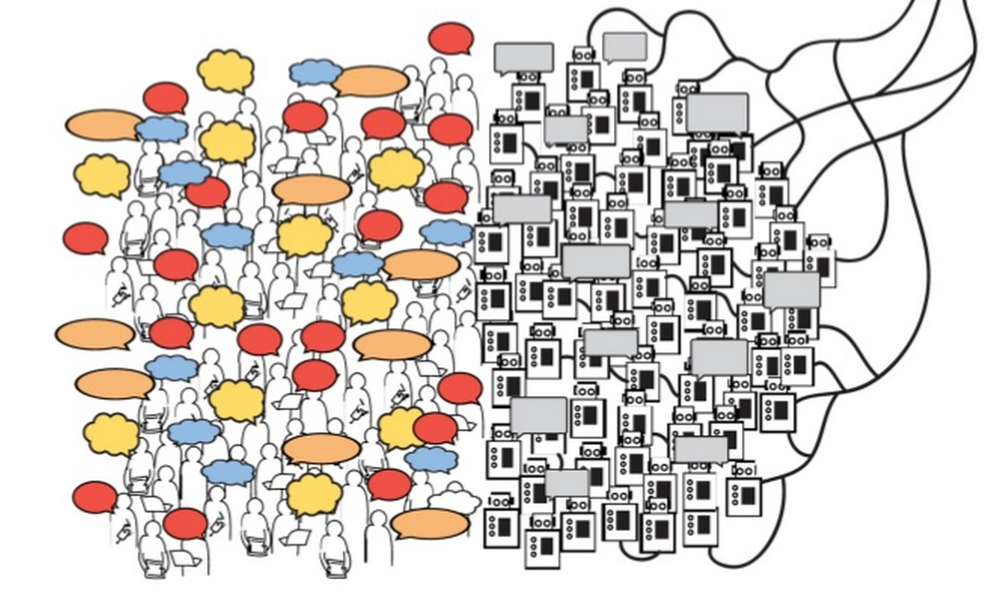
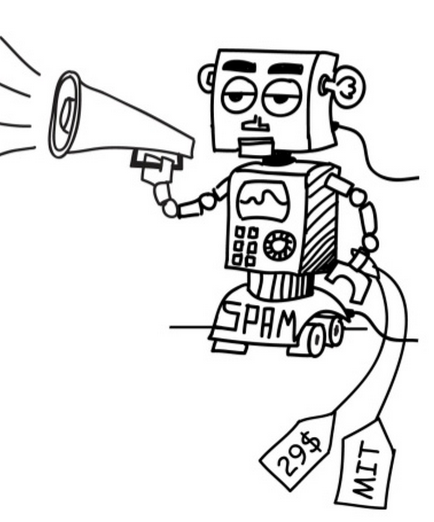
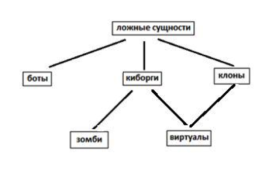
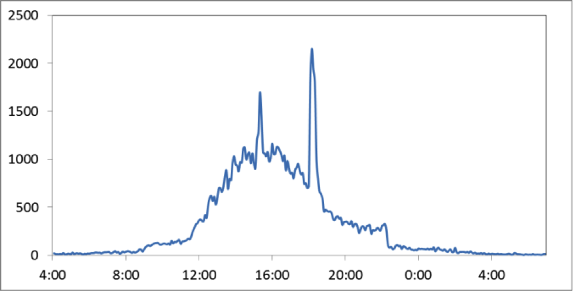
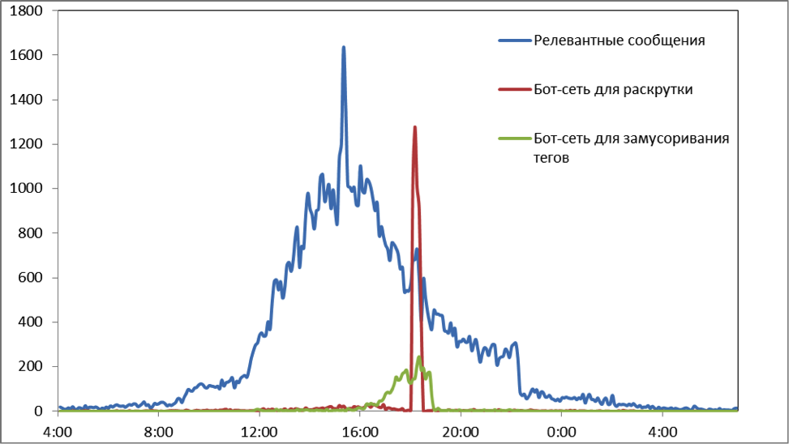
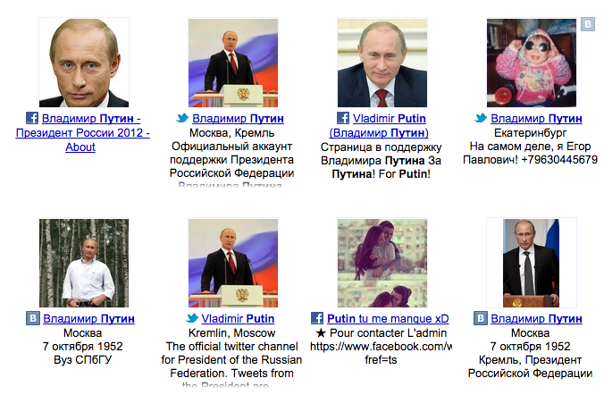
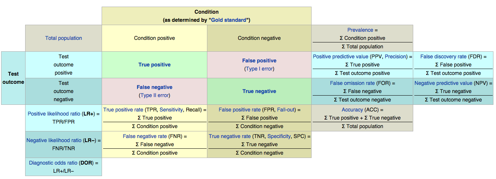

Astroturfing
========================================================
transition: rotate

## Lecture 9

Bots or not?
========================================================
type: sub-section

## Astroturfing

* Wider
* Not only about bots
* It's about goals, not means

## Astroturfing

* Grassroots movement

Some facts
========================================================

* ~ 7% of tweeter accounts are bots.
* ~20% of users accept unknown friends requests.
* ~30% of users can be deceived by bots.
* ~40% of ratings/reviews are fake.

A long time ago in a galaxy far far away...
========================================================

Spam became social:

* Chat bots
* Not efficient
* Easily-detected

***

Bots evolve
=======================================================

* Bots-2.0
* Fakes
* Cyborgs
* What else?

***

Classification
=======================================================
type: sub-section

Who is tweeting on Twitter: human, bot, or cyborg? // Z Chu

Bots
=======================================================

## Bots - for bunch, cheap actions

But! There are several quality-metrics for bots (phone verified/retrieved/etc., etc.)

Their task is to modify counter.

Not usefull for astroturfing (no intension, ease of action)

Could be used for DDoS

Bots
========================================================

## Dec 10, 2011

Bots
========================================================

## Dec 10, 2011

Cyborgs
========================================================

Any type of machine-human mixture

Cyborgs
========================================================

# Two basic types: 

# depends on intention

1. Virtuals: getting benefits from it.
2. Zombies: being used - cyber-security issues.

Virtuals
=======================================================

VIP-accounts, bots-2.0 (by Lutz Finger)

Often being sold as "offers": actions fron "real" people.

Zombies
=======================================================

# Primary channel: "Accs from fakes"

Being sold "by actions", or "as is" with software

Clones
=======================================================

# "Hand made" virtuals

Clones
=======================================================

> Находят моделей, часто даже нанимают за деньги, которые фотографируются для них где угодно: в парке, саду, дома, в машине, в клубе, на кровати, в обнимку с друзьями, в разной одежде, в откровенной одежде, вызывающих позах и вообще как угодно... Почти всегда им либо дают бумажку с надписью "Я не фейк" и фотографируют так, либо за отдельную плату сажают перед камерой и записывают видео 2-5 минут, где девушка подробно объясняет, что она не фикция, она настоящая, имеет свой аккаунт в контакте и даже помнит свой ID, что она сама страдает от фейков . 

Detecting bots
=======================================================
type: sub-section

# Every metric will be fallsified.

## Every measurement will be attacked.

Detecting bots
=======================================================

## How to measure?

Detecting technics
========================================================

# Machine learning problem

### Pros: effectiveness

### Contras: Black box

Detecting technics
========================================================

1. Bayes theorem

   $$ P(A \mid B) = \frac{P(B \mid A) \, P(A)}{P(B)} $$

2. Neural netowrks

   $$ F(t) = \frac{1}{1 + e^t} $$

3. Ensemble methods

   Random forests, Ada Boost

Detecting technics
========================================================

## 1st task: prepare sample

* Manual classification
* Blacklisting
* Honeypots

Detecting technics
========================================================

# Feature lists:

## - Eigen features

## - Collective features

Account properties
========================================================

Friends/followers

Availability of additional features (has avatar or not)

Quality of found features (avatar could be found using images search)

Content properties
========================================================

# All kind of autoregressions:

* Date-time similarity
* Links (domains similarity)
* Mentions / content

You could try entropy:

$$ H(X) = -\sum_i{P(x_i) \log{P(x_i)}} $$

Text similarity
========================================================

### Hash-functions

## Local sensitive hashing

# Nilsimsa

Collective features
========================================================

# Network features

## Shape of network

### Network density and connected components

# Simultaneousness
