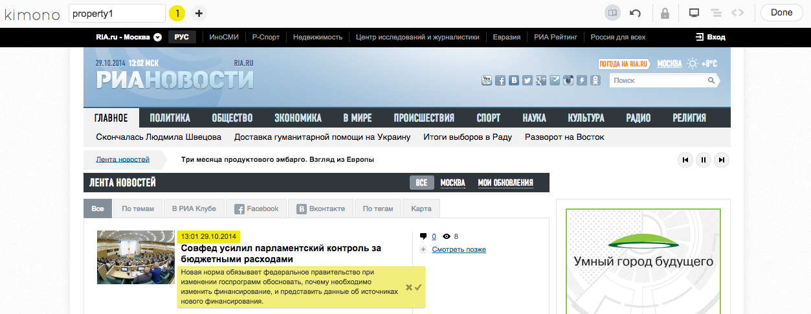
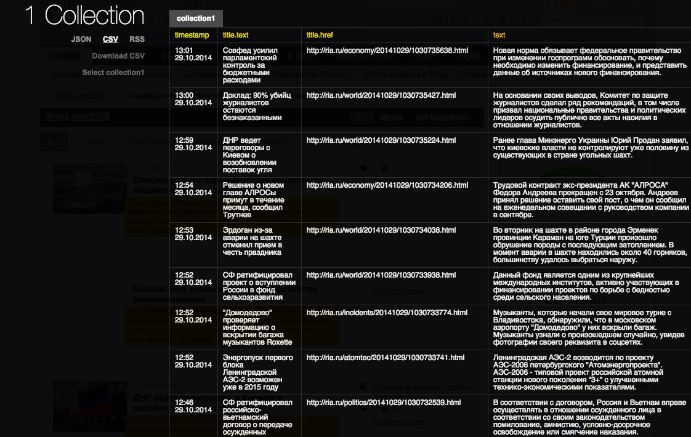
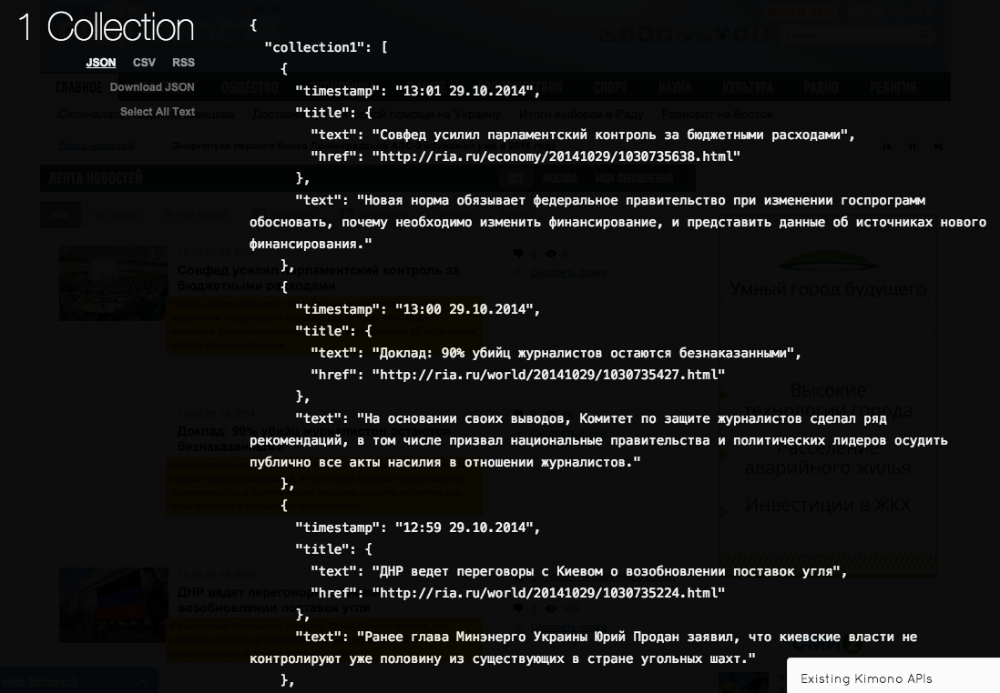
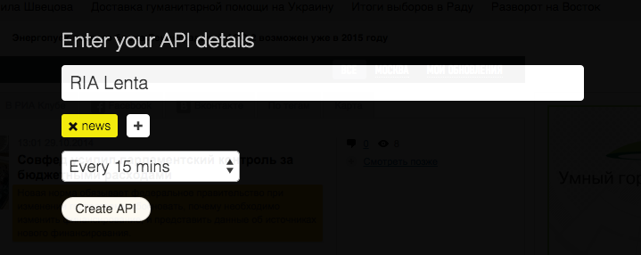
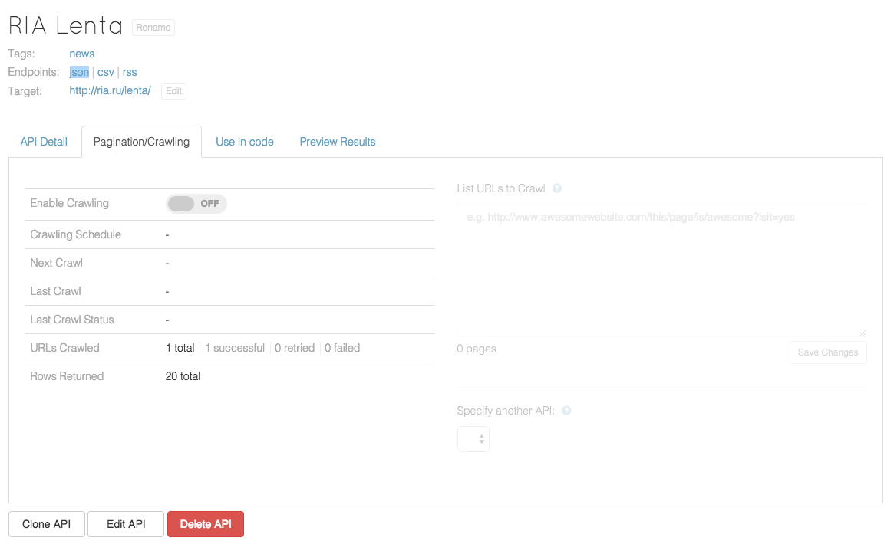
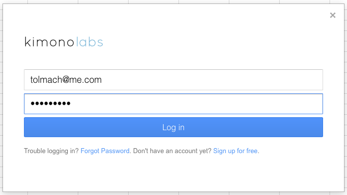

Build your own API
========================================================
transition: rotate

## Practice 2

Download app
==============================

Create accaunt on [Kimono Labs](https://www.kimonolabs.com)

Starting app
==============================

* Look for icon in the browser

* Navigate to page, you are interested in, and press kimono icon

Select parts of data
==============================

* For every property: Select examples

* Ferify or reject Kimono suggestions

Look through gathered data
==============================

Look through gathered data
==============================

Name and tag your API
==============================

Enjoy!
==============================

There is an app for Google sheets
=================================

But pagination in R/Python is better
=========================================

### `https://www.kimonolabs.com/api/{page_id}/{api_id}?apikey={api_key}`

It's your turn
==============================

