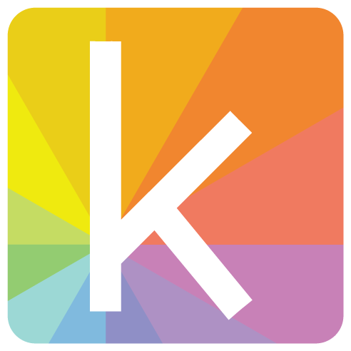
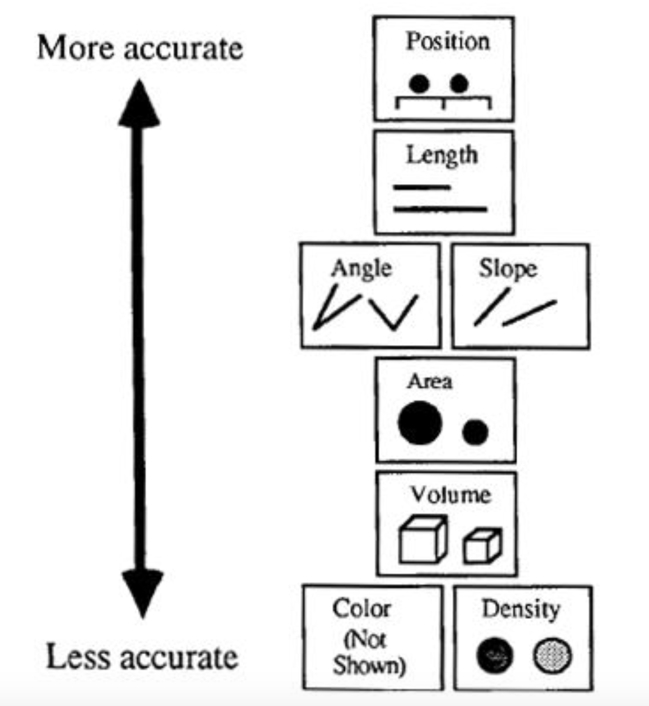
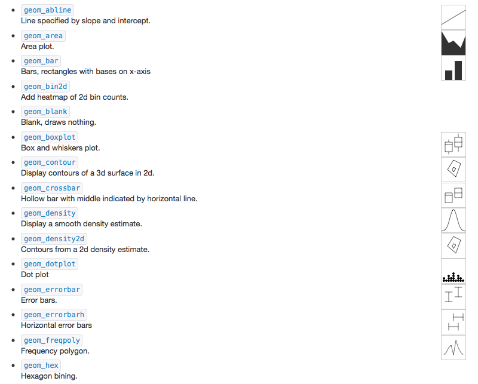
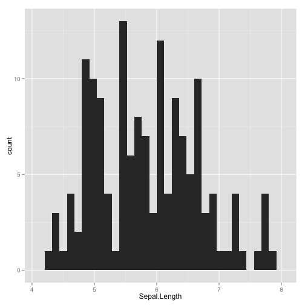
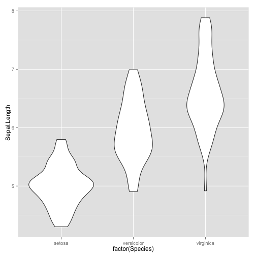
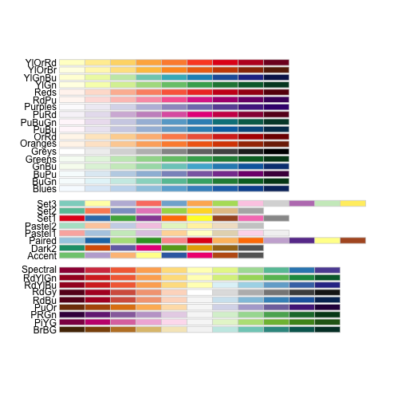
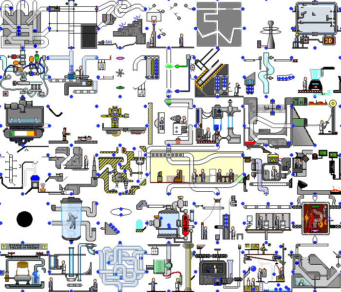

Dealing with API in R
========================================================
transition: rotate



## Practice 3

***


Let's start
==================================================

## Full script:

[http://pastebin.com/74tpbMzR](http://pastebin.com/74tpbMzR)

## Declaring encoding and variables

```
# -*- coding: utf-8 -*-
```

## Go to `kimonolabs.com`, login and get your own credentials


```r
api.name <- '1xl232p8'
api.key <- 'DTndIua4tfpz5kxITOILI6FvmGV8xw9g'
```

Adding packages
===============================================

## Install required packages
```r
install.packages("RCurl", "rjson")
```

## And load them

```r
library(RCurl)
library(rjson)
```

Getting data from web
============================================

```r
json.url <- paste0('https://www.kimonolabs.com/api/', api.name, '?apikey=', api.key)
json.url
```

```
[1] "https://www.kimonolabs.com/api/1xl232p8?apikey=DTndIua4tfpz5kxITOILI6FvmGV8xw9g"
```

```
json.file <- getURL(json.url, .encoding = 'UTF-8')
json.data <- fromJSON(json.file)
```

Json transformed to list
==========================================
```
$name
[1] "RIA Lenta"

$count
[1] 20

$frequency
[1] "Every 15 mins"

$version
[1] 81

$newdata
[1] FALSE

$lastrunstatus
[1] "success"

$thisversionrun
[1] "Fri Oct 30 2014 06:10:49 GMT+0000 (UTC)"

$lastsuccess
[1] "Fri Oct 30 2014 06:25:59 GMT+0000 (UTC)"

$nextrun
[1] "Fri Oct 30 2014 06:40:59 GMT+0000 (UTC)"

$results
```

Creating Datetime objects
============================

```r
# seconds since epoch
as.POSIXct()

# list of parameters
as.POSIXlt()

# Date only
as.Date()

# Convert strings to datetime
strptime(x, format)
```

From datetime to common types
=============================

```r
# get element from POSIXlt
# sec, min, hour, mday, mon, years, wday, yday

# Specify format
strftime(x, format)
# formats:
# %Y, %m, %d, %b, %H, %M, %S...

# tiemdelta: in seconds:
Sys.time() - 3600
```

Strings
============================


```r
s <- 'This is my test string'
substr(s, 6, 7)
```

```
[1] "is"
```

```r
strsplit(s, ' ')
```

```
[[1]]
[1] "This"   "is"     "my"     "test"   "string"
```

```r
tolower(s)
```

```
[1] "this is my test string"
```

Looking for exact matches
==============================

Simple usage:

```r
grep(pattern, x)
```

Complicated:

```r
grep(pattern, x, ignore.case = FALSE, value = FALSE,
     fixed = FALSE, invert = FALSE)
```

Wide and long data
==================================


```r
head(airquality)
```

```
  Ozone Solar.R Wind Temp Month Day
1    41     190  7.4   67     5   1
2    36     118  8.0   72     5   2
3    12     149 12.6   74     5   3
4    18     313 11.5   62     5   4
5    NA      NA 14.3   56     5   5
6    28      NA 14.9   66     5   6
```

Wide and long data
==================================

```r
library(reshape2)
long <- melt(airquality, id.vars=c('Month', 'Day'))
head(long)
```

```
  Month Day variable value
1     5   1    Ozone    41
2     5   2    Ozone    36
3     5   3    Ozone    12
4     5   4    Ozone    18
5     5   5    Ozone    NA
6     5   6    Ozone    28
```

Wide and long data
==================================

```r
wide <- dcast(long, Month + Day ~ variable)
head(wide)
```

```
  Month Day Ozone Solar.R Wind Temp
1     5   1    41     190  7.4   67
2     5   2    36     118  8.0   72
3     5   3    12     149 12.6   74
4     5   4    18     313 11.5   62
5     5   5    NA      NA 14.3   56
6     5   6    28      NA 14.9   66
```

Visualisation: forms and variables
============================



ggplot2
============================

[http://docs.ggplot2.org/current/](http://docs.ggplot2.org/current/)



ggplot2
============================


```r
library(ggplot2)
qplot(Sepal.Length, data=iris, geom="histogram")
```

 

***


```r
qplot(factor(Species), Sepal.Length, data=iris, geom="violin")
```

 

Colors
============================


```r
library(RColorBrewer)
display.brewer.all()
```

 

***

## [Cynthia A. Brewer](http://www.personal.psu.edu/cab38/)

Colors for cartography

3 types of palettes:
* Sequental
* Qualitative
* Diverging

How it was?
==============================


